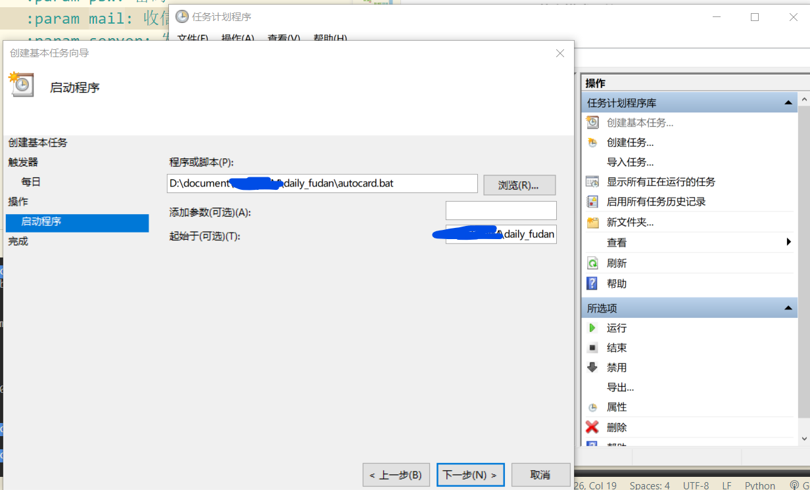

# daily_fudan
一键平安复旦小脚本


[使用说明](https://zhuanlan.zhihu.com/p/141091735)

Edit by siran:

本项目仅作技术交流，请根据身体实际情况进行打卡，疫情期间对自己对他人的生命安全负责，如发生瞒报等违法行为，与本项目无关

### 基本使用

仅考虑源码使用
请确保安装python3

``` shell
git clone https://github.com/VealM/daily_fudan.git
pip -r requirements.txt
python3 dailyFudan.3.0.py
```

### 新功能

在原有代码基础上，增加了如下功能

- 1 多人打卡模式 
- 2 重要节点输出以logging形式保存至daily.log文件
- 3 每日邮件汇报打卡情况

初次使用，程序要求输入
*所有参与打卡用户信息 fdu学号 fdu密码 打卡状态收件邮箱*


首次输入后，信息将以如下的格式存在同级目录下accounts.txt中
学号1:密码1:收件邮箱1
学号2:密码2:收件邮箱2

**如果输错了，删掉accounts.txt再重新输入！！！或者按格式手动修改accounts.txt！！！是英文模式下的:**

*管理员发件邮箱*

需要发件人给打卡的大家写信

初次使用，程序要求输入
*管理员邮箱服务器信息及发件账号及登陆凭证*

首次输入后，信息将以如下的格式存在同级目录下admin.txt中
应具有如下形式
smtp.fdu.edu.cn:25:xxxx@fdu.edu.cn:xxxxx
*教育邮箱的登陆凭证一般为密码，163和QQ则为客户端授权码*

**如果输错了，删掉admin.txt再重新输入！！！或者按格式手动修改admin.txt！！！是英文模式下的:**

### 定时使用

#### win10

使用任务计划管理程序

- 创建基本任务
主要介绍操作-启动程序这一步



类似于linux下的sh文件，win10下使用bat进行批处理

``` shell
❯ cat .\autocard.bat
python3 dailyFudan3.0.py
```

起始填bat文件所在文件夹的位置即可

#### Linux

建议使用systemd
需要启动打卡的service文件和定时timer文件

``` shell
cd /usr/lib/systemd/system
touch card.service card.timer
```

查看card.service内容

``` shell
(base) [root@localhost system]# cat card.service  
[Unit]
Description=card

[Service]
ExecStart=/bin/bash /PATHTO/run.sh
```

你应该试下card.service能不能正常启动

``` shell
systemctl restart card.service
systemctl status card.service
```

查看card.timer内容

```shell
(base) [root@localhost system]# cat card.timer 
[Unit]
Description=Run my card

[Timer]
OnCalendar=*-*-* 00:00:00
Unit=card.service

[Install]
WantedBy=multi-user.target
```

同样你也应该看下timer能否正常启动

``` shell
systemctl restart card.timer
systemctl status card.timer
```

足够幸运的话，你会收到邮件

#### 近期勘误

修正run.sh，切入脚本所在路径
增加shell脚本激活conda环境
需要将conda.sh传递给conda 随后才能使用conda activate命令
``` shell
source /home/hopeful/anaconda3/etc/profile.d/conda.sh
conda acitvate base
```